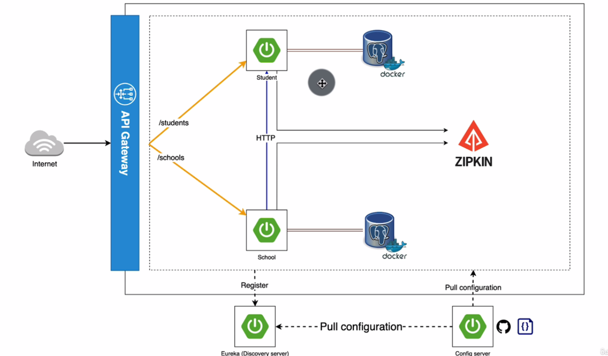

# micro-services-spring-boot

Spring Boot 3 micro-services comprising of :  
- a config-server
- service discovery with Eureka
- distributed tracing system with Zipkin
- data persistence for each microservice with Postgres
- API gateway
- schools micro-service
- students micro-service
- openFeign for inter service comms

